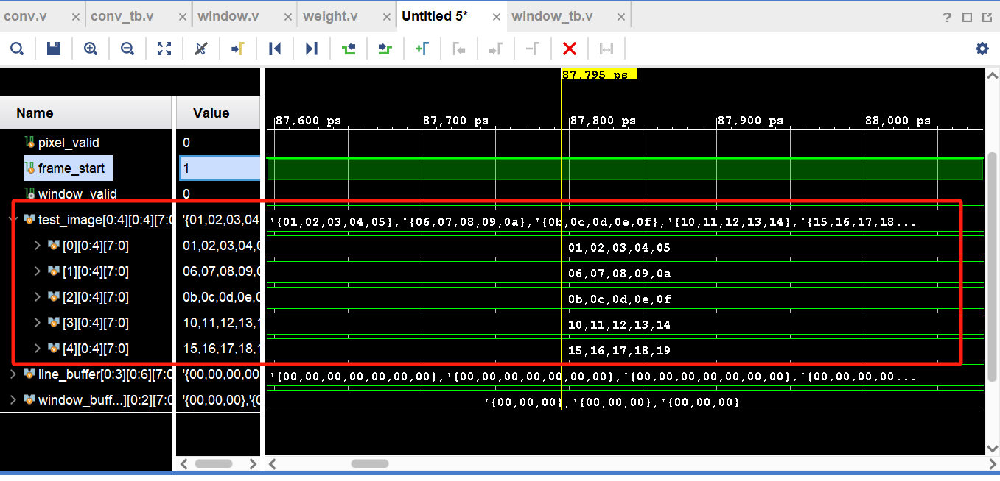
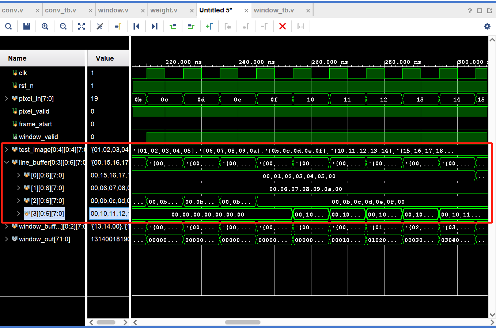
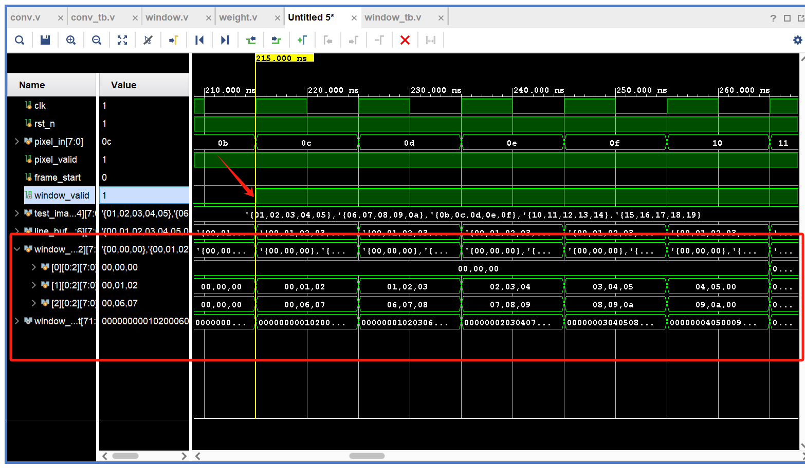

我最近在从事一项很有意思的项目，我想在PFGA上部署CNN并实现手写图片的识别。而本篇文章，是我迈出的第一步。具体代码已发布在[github上](https://github.com/ZZhiHao196/CNN)

## 模块介绍

卷积神经网络（CNN)可以分为卷积层、池化层、激活层、全链接层结构，本篇要实现的，就是CNN的卷积层中的window窗。

在卷积过程中，最复杂的就是卷积运算，也就是Filter和图片（输入）相乘然后在相加的这一步骤。


我此处的构想就是将其卷积这个步骤进行拆分：加窗、载入权重、卷积运算。因而对应3个模块，而此处实现的就是加窗这个模块。而他主要负责的功能就是：==提取输入图片中的数据，生成对应的窗口==。 如上图所示，对x[:,:,0]图片进行窗口提起，提取的第一个窗口(左上角第一个)就是

$\begin{bmatrix}0&0&0\\0&0&1\\0&0&1\end{bmatrix} $


## 代码

1. **可配置参数、输入和输出定义**

STRIDE为窗口滑动的步长，KERNEL_SIZE对应输入卷积核的大小，PADDING 为补充的长度

pixel_in 为输出的图片数据，frame_start 为图片开始输入的标志，pixel_valid为输入有效标志

window_out是图片展成一维的窗口数据

```verilog
module window #(
    parameter DATA_WIDTH = 16,             // Width of each pixel data
    parameter IMG_WIDTH = 32,             // Width of input image
    parameter IMG_HEIGHT = 32,            // Height of input image
    parameter KERNEL_SIZE = 3,            // Size of convolution window (square)
    parameter STRIDE = 1,                 // Stride of convolution
    parameter PADDING = (KERNEL_SIZE - 1) / 2  // Padding size calculated for SAME mode
)
(
    input wire clk,                       // Clock signal
    input wire rst_n,                     // Active low reset
    input wire [DATA_WIDTH-1:0] pixel_in, // Input pixel data
    input wire pixel_valid,               // Input pixel valid signal
    input wire frame_start,               // Start of new frame signal
    
    output reg [KERNEL_SIZE*KERNEL_SIZE*DATA_WIDTH-1:0] window_out, // Flattened window output
    output reg window_valid              // Window data valid
);
```

2. 内部信号定义

输入的图片数据是一个一个输入的，用x_pos和y_pos 来记录当前pixel位于图片中的位置

窗口在图片上滑动，用x_window，y_window用来判断窗口目前的位置

line_Buffer缓存输入的数据，同时进行padding操作, 形成数据窗口，而window_buffer 在line_buffer上进行滑动，形成窗口

然后是状态机，分为三个状态 IDLE, LOAD,PROCESS, 分别对应空闲，载入（开始载入数据），处理（形成window）

```verilog
// Internal signals
reg [5:0] x_pos, y_pos;                  // Current input pixel position
reg [5:0] x_window, y_window;            // Window center position
reg [DATA_WIDTH-1:0] line_buffer [0:KERNEL_SIZE][0:IMG_WIDTH+2*PADDING-1]; // Line buffer
reg [DATA_WIDTH-1:0] window_buffer [0:KERNEL_SIZE-1][0:KERNEL_SIZE-1]; // Window buffer
reg signed [6:0] src_y, src_x;           // Temporary variables for coordinate calculation

// State machine
reg [1:0] current_state, next_state;
localparam IDLE = 2'b00, LOAD = 2'b01, PROCESS = 2'b10;

// Loop variables
integer i, j, k;
```

3. **状态的赋值以及跳转**

当接收到frame_start信号（图片开始输入），状态从空闲进入到LOAD状态；

当目前的图片数据可以已经足够，可以用来生成**稳定**的输出窗口时，进入到PROCESS状态

当目前滑窗口提取完对应数据窗口后，回到IDLE状态

注：y_pos从0到KERNEL_SIZE-1时，已经有了KERNEL_SIZE行数据了，可以进入窗口数据提取阶段；实际上可以更早进入，因为存在Padding。当y_pos=KERNEL_SIZE-Padding-1的时候，就可以进入了

```verilog
// FSM state transitions
always @(posedge clk or negedge rst_n) begin
    if (!rst_n) 
        current_state <= IDLE;
    else 
        current_state <= next_state;
end

always @(*) begin
    case (current_state)
        IDLE:    next_state = frame_start ? LOAD : IDLE;
        LOAD:    next_state = (y_pos >= KERNEL_SIZE-1) ? PROCESS : LOAD;
        PROCESS: next_state = (y_window >= IMG_HEIGHT && x_window == 0) ? IDLE : PROCESS;
        default: next_state = IDLE;
    endcase
end
```


4. **状态执行**

推荐使用拆分的方法，把一个状态执行的大always块，分成很多子always块。

a. 输入图片数据位置捕获

当前状态为IDLE，图片即将开始输入时，将定位信号复原

当前状态不为IDLE, 同时输入有效，那么坐标根据情况自增

```verilog
// Input pixel position tracking
always @(posedge clk or negedge rst_n) begin
    if (!rst_n) begin
        x_pos <= 0;
        y_pos <= 0;
    end else if (current_state == IDLE && frame_start) begin
        x_pos <= 0;
        y_pos <= 0;
    end else if (pixel_valid && current_state != IDLE) begin
        if (x_pos == IMG_WIDTH-1) begin
            x_pos <= 0;
            y_pos <= y_pos + 1;
        end else begin
            x_pos <= x_pos + 1;
        end
    end
end

```


b. Line_Buffer 的缓冲

1. 每次开启新的一行的数据，对Line_Buffer 全部复位
2. 然后对对应的位置进行实际数据的填充

```verilog
// Line buffer management
always @(posedge clk or negedge rst_n) begin
    if (!rst_n) begin
        for (i = 0; i <= KERNEL_SIZE; i = i + 1)
            for (j = 0; j < IMG_WIDTH + 2*PADDING; j = j + 1)
                line_buffer[i][j] <= 0;
    end else if (pixel_valid && current_state != IDLE) begin
                if (x_pos == 0) begin
            // Clear the line buffer row at the start of each new line
            for (k = 0; k < IMG_WIDTH + 2*PADDING; k = k + 1)
                        line_buffer[y_pos % (KERNEL_SIZE + 1)][k] <= 0;
        end
        line_buffer[y_pos % (KERNEL_SIZE + 1)][x_pos + PADDING] <= pixel_in;
    end
end
```

c .Window position tracking

1. 复位、一帧图片的开始或即将进入PROCESS状态，对window记位进行复位
2. 当前状态位PROCESS状态，同时没有超过当前图片的高度时，对window的位置进行对应的变化

```verilog
// Window position tracking
always @(posedge clk or negedge rst_n) begin
    if (!rst_n || frame_start || (current_state == LOAD && next_state == PROCESS)) begin
        x_window <= 0;
        y_window <= 0;
    end else if (current_state == PROCESS && y_window < IMG_HEIGHT) begin
        if (x_window + STRIDE >= IMG_WIDTH) begin
                    x_window <= 0;
                    y_window <= y_window + STRIDE;
                end else begin
                    x_window <= x_window + STRIDE;
                end
    end
end
```

d. window_buffer的处理

```verilog
// Window generation and output
always @(posedge clk or negedge rst_n) begin
    if (!rst_n) begin
        window_valid <= 0;
        for (i = 0; i < KERNEL_SIZE; i = i + 1)
            for (j = 0; j < KERNEL_SIZE; j = j + 1)
                window_buffer[i][j] <= 0;
    end else begin
        window_valid <= 0; // Default
        
        if (current_state == PROCESS && 
            x_window < IMG_WIDTH && 
            y_window < IMG_HEIGHT && 
            y_window + (KERNEL_SIZE>>1) <= y_pos) begin
            // Generate window
            for (i = 0; i < KERNEL_SIZE; i = i + 1) begin
                for (j = 0; j < KERNEL_SIZE; j = j + 1) begin
                    src_y = y_window + i - (KERNEL_SIZE>>1);
                    src_x = x_window + j - (KERNEL_SIZE>>1);
                    
                    if (src_y >= 0 && src_y < IMG_HEIGHT && 
                        src_x >= 0 && src_x < IMG_WIDTH) begin
                        window_buffer[i][j] <= line_buffer[src_y % (KERNEL_SIZE + 1)][src_x + PADDING];
                        end else begin
                        window_buffer[i][j] <= 0; // Padding
                        end
                    end
                end
                window_valid <= 1;
            end 
    end
end

```


当window坐标没有超过图片大小，确保可以生成窗口时，获取生成。对KERNEL_SIZE>>1，等价于KERNEL_SIZE/2,表示中心位置的偏移量

e.g.

```bash
[0,0] [0,1] [0,2]    [-1,-1] [-1, 0] [-1,+1]
[1,0] [1,1] [1,2] -> [ 0,-1] [ 0, 0] [ 0,+1]  <- (1,1)是中心
[2,0] [2,1] [2,2]    [+1,-1] [+1, 0] [+1,+1]
```

这样就可以将卷积索引转换为相对于中心的坐标，这样可以用于判断是否越界,从而进行padding补充

以KERNEL_SIZE=3为例

| 卷积核位置 |   src坐标计算   | 结果 |   取值    |
| :--------: | :-------------: | :--: | :-------: |
|    0,0     | scr_y=0+0-1=-1  | 越界 |  padding  |
|    0,1     | src_y=0+0-1=-1  | 越界 |  padding  |
|    0,2     | src_y=0+0-1=-1  | 越界 |  padding  |
|    1,0     | src_x=0+0-1=-1  | 越界 |  padding  |
|    1,1     | src_y=0,src_x=0 | 有效 | 原图[0,0] |
|    1,2     | src_y=0,src_x=1 | 有效 | 原图[0,1] |
|    2,0     | src_x=0+0-1=-1  | 越界 |  padding  |
|    2,1     | src_y=1,src_x=0 | 有效 | 原图[1,0] |
|    2,2     | scr_y=1,src_x=1 | 有效 | 原图[1,1] |


e. 数据窗口的展平

将原本二维的的数据(宽为KERNEL_SIZE, 高为KERNEL_SIZE, 位宽为DATA_WIDTH)的数据，按照从罪小位排在最高位的顺序，压缩成一维的数据

```verilog
// Flatten window buffer for output
always @(*) begin
    for (i = 0; i < KERNEL_SIZE; i = i + 1) begin
        for (j = 0; j < KERNEL_SIZE; j = j + 1) begin
            window_out[(KERNEL_SIZE*KERNEL_SIZE-(i*KERNEL_SIZE+j))*DATA_WIDTH-1 -: DATA_WIDTH] = window_buffer[i][j];
        end
    end
end

endmodule
```

## 测试

```verilog
`timescale 1ns / 1ps

module window_tb();

    // 测试用参数 - 使用小尺寸便于观察
    parameter DATA_WIDTH = 8;
    parameter IMG_WIDTH = 32;
    parameter IMG_HEIGHT = 32;
    parameter KERNEL_SIZE = 3;
    parameter STRIDE = 1;
    parameter PADDING = (KERNEL_SIZE - 1) / 2;
    
    // 测试信号
    reg clk;
    reg rst_n;
    reg [DATA_WIDTH-1:0] pixel_in;
    reg pixel_valid;
    reg frame_start;
    
    wire [KERNEL_SIZE*KERNEL_SIZE*DATA_WIDTH-1:0] window_out;
    wire window_valid;
    
    // 实例化被测模块
    window #(
        .DATA_WIDTH(DATA_WIDTH),
        .IMG_WIDTH(IMG_WIDTH),
        .IMG_HEIGHT(IMG_HEIGHT),
        .KERNEL_SIZE(KERNEL_SIZE),
        .STRIDE(STRIDE),
        .PADDING(PADDING)
    ) dut (
        .clk(clk),
        .rst_n(rst_n),
        .pixel_in(pixel_in),
        .pixel_valid(pixel_valid),
        .frame_start(frame_start),
        .window_out(window_out),
        .window_valid(window_valid)
    );
    
    // 时钟生成
    initial begin
        clk = 0;
        forever #5 clk = ~clk;
    end
    
    // 测试数据 - 5x5图像
    reg [DATA_WIDTH-1:0] test_image [0:IMG_HEIGHT-1][0:IMG_WIDTH-1];
    
    // 窗口计数器
    integer window_count = 0;
    
    // 初始化测试图像
    
      task reset_test_image;
        integer i, j;
        begin
            for(i = 0; i < IMG_HEIGHT; i = i + 1) begin
                for(j = 0; j < IMG_WIDTH; j = j + 1) begin
                    test_image[i][j] =0;
                end
            end
        end
    endtask
    
    task init_test_image;
        integer i, j;
        begin
            for(i = 0; i < IMG_HEIGHT; i = i + 1) begin
                for(j = 0; j < IMG_WIDTH; j = j + 1) begin
                    test_image[i][j] = i * IMG_WIDTH + j + 1;
                end
            end
        end
    endtask
    
    // 显示测试图像
    task display_test_image;
        integer i, j;
        begin
            $display("\n=== 4x4 Test Image ===");
            for(i = 0; i < IMG_HEIGHT; i = i + 1) begin
                $write("Row %0d: ", i);
                for(j = 0; j < IMG_WIDTH; j = j + 1) begin
                    $write("%3d ", test_image[i][j]);
                end
                $display("");
            end
            $display("======================\n");
        end
    endtask
    
    // 发送一帧图像数据
    task send_frame;
        integer i, j;
        begin
            $display("Sending 4x4 frame...");
            init_test_image();
            display_test_image();
            
            // 发送frame_start信号
            @(posedge clk);
            frame_start = 1;
            @(posedge clk);
            frame_start = 0;
            
            // 逐像素发送数据
            for(i = 0; i < IMG_HEIGHT; i = i + 1) begin
                for(j = 0; j < IMG_WIDTH; j = j + 1) begin
                    @(posedge clk);
                    pixel_in = test_image[i][j];
                    pixel_valid = 1;
                    $display("Sending pixel[%0d][%0d] = %0d at time %0t", i, j, pixel_in, $time);
                end
            end
            
            @(posedge clk);
            pixel_valid = 0;
            $display("All pixels sent at time %0t", $time);
        end
    endtask
    
    // 主测试序列
    initial begin
        $display("========================================");
        $display("Window Test - Focus on Last Window");
        $display("IMG_SIZE: %0dx%0d, KERNEL: %0dx%0d", IMG_WIDTH, IMG_HEIGHT, KERNEL_SIZE, KERNEL_SIZE);
        $display("Expected windows: %0d", IMG_WIDTH * IMG_HEIGHT);
        $display("========================================");
        
        // 初始化信号
        rst_n = 0;
        pixel_in = 0;
        pixel_valid = 0;
        frame_start = 0;
        
        reset_test_image();
        // 复位序列
        repeat(5) @(posedge clk);
        rst_n = 1;
        repeat(3) @(posedge clk);
        
        // 发送测试帧
        send_frame();
        
        // 等待所有窗口输出
        repeat(50) @(posedge clk);
        
        $display("\n========================================");
        $display("Test Summary:");
        $display("Total Windows Generated: %0d", window_count);
        $display("Expected Windows: %0d", IMG_WIDTH * IMG_HEIGHT);
        if(window_count == IMG_WIDTH * IMG_HEIGHT) begin
            $display("SUCCESS: All windows generated!");
        end else begin
            $display("FAILURE: Missing windows!");
        end
        $display("========================================");
        
        $finish;
    end
    
    // 窗口监控
    always @(posedge clk) begin
        if(window_valid) begin
            window_count = window_count + 1;
            $display("Window %0d: pos(%0d,%0d) at time %0t", 
                     window_count, dut.x_window, dut.y_window, $time);
            
            // 显示窗口内容
            $write("Window content: ");
            $write("[%0d %0d %0d] ", 
                   window_out[71:64], window_out[63:56], window_out[55:48]);
            $write("[%0d %0d %0d] ", 
                   window_out[47:40], window_out[39:32], window_out[31:24]);
            $write("[%0d %0d %0d]", 
                   window_out[23:16], window_out[15:8], window_out[7:0]);
            $display("");
        end
    end
    
    // 状态机监控
    reg [1:0] prev_state = 2'b00;
    always @(posedge clk) begin
        if(dut.current_state != prev_state) begin
            case(dut.current_state)
                2'b00: $display("Time %0t: State -> IDLE", $time);
                2'b01: $display("Time %0t: State -> LOAD", $time);
                2'b10: $display("Time %0t: State -> PROCESS", $time);
                default: $display("Time %0t: State -> UNKNOWN(%0d)", $time, dut.current_state);
            endcase
            prev_state = dut.current_state;
        end
    end
    
    
    // 波形转储
    initial begin
        $dumpfile("window_tb.vcd");
        $dumpvars(0, window_tb);
        
        // 限制仿真时间
        #2000;
        $display("ERROR: Simulation timeout!");
        $finish;
    end

endmodule 
```


## 结果

**输入数据**



> Row 0:   1   2   3   4   5 
> Row 1:   6   7   8   9  10 
> Row 2:  11  12  13  14  15 
> Row 3:  16  17  18  19  20 

**Line_Buffer 缓冲数据**



**Window_Buffer输出数据**



valid为高，window_buffer开始提取line_buffer数据，同时输出展平的window_out；


window_buffer提取完毕，valid拉低
