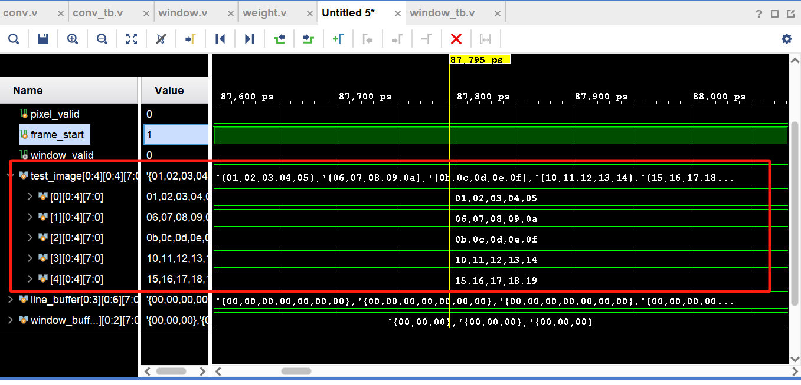
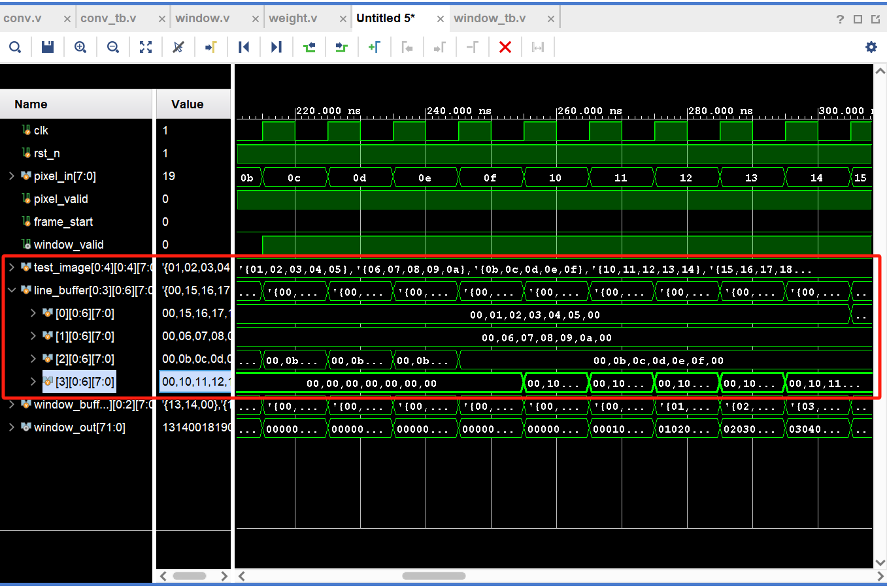
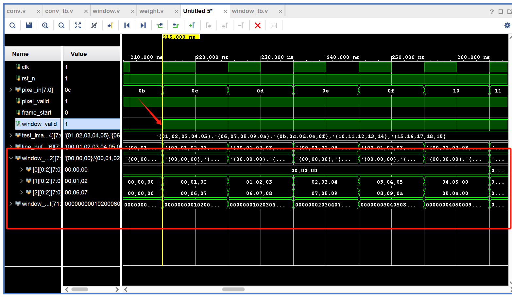
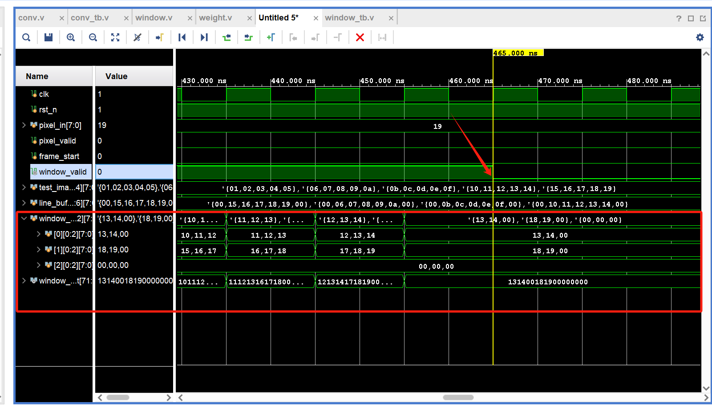

I've recently been working on a very interesting project: deploying a CNN on an FPGA to achieve handwritten digit recognition. This article represents my first step in this endeavor. The specific code has been published on [GitHub](https://www.google.com/search?q=https://github.com/ZZhiHao196/CNN).

## Module Introduction

A Convolutional Neural Network (CNN) can be divided into convolutional layers, pooling layers, activation layers, and fully connected layers. This article focuses on implementing the "window" mechanism within the CNN's convolutional layer.

The most complex part of the convolution process is the convolution operation itself, which involves multiplying the filter with the image (input) and then summing the results.


My idea here is to break down this convolution step into: windowing, loading weights, and the convolution operation. This corresponds to three modules, and the one implemented here is the windowing module. Its main function is to: ==extract data from the input image and generate corresponding windows==. As shown in the image above, when performing window extraction on the image `x[:,:,0]`, the first window extracted (top-left corner) is:

$\begin{bmatrix}0&0&0\\0&0&1\\0&0&1\end{bmatrix} $

## Code

1.  **Configurable Parameters, Inputs, and Outputs Definition**

    `STRIDE` is the sliding step of the window, `KERNEL_SIZE` corresponds to the size of the input convolution kernel, and `PADDING` is the length of the padding.

    `pixel_in` is the input pixel data, `frame_start` is the flag indicating the start of image input, and `pixel_valid` is the input valid flag.

    `window_out` is the flattened one-dimensional window data.

    ```verilog
    module window #(
        parameter DATA_WIDTH = 16,             // Width of each pixel data
        parameter IMG_WIDTH = 32,             // Width of input image
        parameter IMG_HEIGHT = 32,            // Height of input image
        parameter KERNEL_SIZE = 3,            // Size of convolution window (square)
        parameter STRIDE = 1,                 // Stride of convolution
        parameter PADDING = (KERNEL_SIZE - 1) / 2  // Padding size calculated for SAME mode
    )
    (
        input wire clk,                       // Clock signal
        input wire rst_n,                     // Active low reset
        input wire [DATA_WIDTH-1:0] pixel_in, // Input pixel data
        input wire pixel_valid,               // Input pixel valid signal
        input wire frame_start,               // Start of new frame signal

        output reg [KERNEL_SIZE*KERNEL_SIZE*DATA_WIDTH-1:0] window_out, // Flattened window output
        output reg window_valid              // Window data valid
    );
    ```

2.  **Internal Signals Definition**

    Input pixel data arrives one by one. `x_pos` and `y_pos` are used to record the current pixel's position in the image.

    The window slides across the image. `x_window` and `y_window` are used to determine the current position of the window.

    `line_buffer` caches the input data and performs padding operations to form the data window. `window_buffer` slides over `line_buffer` to form the window.

    Then there is a state machine with three states: `IDLE`, `LOAD`, and `PROCESS`, corresponding to idle, loading (starting to load data), and processing (forming the window), respectively.

    ```verilog
    // Internal signals
    reg [5:0] x_pos, y_pos;                  // Current input pixel position
    reg [5:0] x_window, y_window;            // Window center position
    reg [DATA_WIDTH-1:0] line_buffer [0:KERNEL_SIZE][0:IMG_WIDTH+2*PADDING-1]; // Line buffer
    reg [DATA_WIDTH-1:0] window_buffer [0:KERNEL_SIZE-1][0:KERNEL_SIZE-1]; // Window buffer
    reg signed [6:0] src_y, src_x;           // Temporary variables for coordinate calculation

    // State machine
    reg [1:0] current_state, next_state;
    localparam IDLE = 2'b00, LOAD = 2'b01, PROCESS = 2'b10;

    // Loop variables
    integer i, j, k;
    ```

3.  **State Assignment and Transitions**

    When the `frame_start` signal is received (image input begins), the state transitions from `IDLE` to `LOAD`.

    When the current image data is sufficient to generate a **stable** output window, the state transitions to `PROCESS`.

    When the sliding window has finished extracting the corresponding data window, the state returns to `IDLE`.

    Note: When `y_pos` goes from 0 to `KERNEL_SIZE-1`, there are `KERNEL_SIZE` rows of data, and the window data extraction phase can begin. In practice, it can enter this phase earlier due to padding. When `y_pos = KERNEL_SIZE - PADDING - 1`, it can enter the `PROCESS` state.

    ```verilog
    // FSM state transitions
    always @(posedge clk or negedge rst_n) begin
        if (!rst_n)
            current_state <= IDLE;
        else
            current_state <= next_state;
    end

    always @(*) begin
        case (current_state)
            IDLE:    next_state = frame_start ? LOAD : IDLE;
            LOAD:    next_state = (y_pos >= KERNEL_SIZE-1) ? PROCESS : LOAD;
            PROCESS: next_state = (y_window >= IMG_HEIGHT && x_window == 0) ? IDLE : PROCESS;
            default: next_state = IDLE;
        endcase
    end
    ```

4.  **State Execution**

    It is recommended to use a split approach, dividing a large `always` block for state execution into many smaller `always` blocks.

    a. **Input Pixel Data Position Capture**

    When the current state is `IDLE` and image input is about to start, the positioning signals are reset.

    If the current state is not `IDLE` and the input is valid, the coordinates are incremented accordingly.

    ````verilog
    // Input pixel position tracking
    always @(posedge clk or negedge rst_n) begin
        if (!rst_n) begin
            x_pos <= 0;
            y_pos <= 0;
        end else if (current_state == IDLE && frame_start) begin
            x_pos <= 0;
            y_pos <= 0;
        end else if (pixel_valid && current_state != IDLE) begin
            if (x_pos == IMG_WIDTH-1) begin
                x_pos <= 0;
                y_pos <= y_pos + 1;
            end else begin
                x_pos <= x_pos + 1;
            end
        end
    end
    ```
    ````

    b. **Line_Buffer Buffering**

    1.  Each time a new row of data starts, the entire `Line_Buffer` is reset.
    2.  Then, the corresponding positions are filled with actual data.

    ```verilog
    // Line buffer management
    always @(posedge clk or negedge rst_n) begin
        if (!rst_n) begin
            for (i = 0; i <= KERNEL_SIZE; i = i + 1)
                for (j = 0; j < IMG_WIDTH + 2*PADDING; j = j + 1)
                    line_buffer[i][j] <= 0;
        end else if (pixel_valid && current_state != IDLE) begin
                    if (x_pos == 0) begin
                // Clear the line buffer row at the start of each new line
                for (k = 0; k < IMG_WIDTH + 2*PADDING; k = k + 1)
                            line_buffer[y_pos % (KERNEL_SIZE + 1)][k] <= 0;
            end
            line_buffer[y_pos % (KERNEL_SIZE + 1)][x_pos + PADDING] <= pixel_in;
        end
    end
    ```

    c. **Window Position Tracking**

    1.  Reset, the start of an image frame, or just before entering the `PROCESS` state, resets the window position.
    2.  When the current state is `PROCESS` and the window has not exceeded the current image height, the window position is updated accordingly.

    ````verilog

    // Window position tracking
    always @(posedge clk or negedge rst_n) begin
        if (!rst_n || frame_start || (current_state == LOAD && next_state == PROCESS)) begin
            x_window <= 0;
            y_window <= 0;
        end else if (current_state == PROCESS && y_window < IMG_HEIGHT) begin
            if (x_window + STRIDE >= IMG_WIDTH) begin
                        x_window <= 0;
                        y_window <= y_window + STRIDE;
                    end else begin
                        x_window <= x_window + STRIDE;
                    end
        end
    end
    ```
    ````

    d. **window_buffer Processing**

    ```verilog
    always @(posedge clk or negedge rst_n) begin
        if (!rst_n) begin
            window_valid <= 0;
            for (i = 0; i < KERNEL_SIZE; i = i + 1)
                for (j = 0; j < KERNEL_SIZE; j = j + 1)
                    window_buffer[i][j] <= 0;
        end else begin
            window_valid <= 0; // Default

            if (current_state == PROCESS &&
                x_window < IMG_WIDTH &&
                y_window < IMG_HEIGHT &&
                y_window + (KERNEL_SIZE>>1) <= y_pos) begin
                // Generate window
                for (i = 0; i < KERNEL_SIZE; i = i + 1) begin
                    for (j = 0; j < KERNEL_SIZE; j = j + 1) begin
                        src_y = y_window + i - (KERNEL_SIZE>>1);
                        src_x = x_window + j - (KERNEL_SIZE>>1);

                        if (src_y >= 0 && src_y < IMG_HEIGHT &&
                            src_x >= 0 && src_x < IMG_WIDTH) begin
                            window_buffer[i][j] <= line_buffer[src_y % (KERNEL_SIZE + 1)][src_x + PADDING];
                            end else begin
                            window_buffer[i][j] <= 0; // Padding
                            end
                        end
                    end
                    window_valid <= 1;
                end
        end
    end

    ```

    ````

    When the window coordinates do not exceed the image size, ensuring that a window can be generated, the generation proceeds. `KERNEL_SIZE>>1` is equivalent to `KERNEL_SIZE/2`, representing the offset of the center position.

    e.g.
    ```bash
    [0,0] [0,1] [0,2]    [-1,-1] [-1, 0] [-1,+1]
    [1,0] [1,1] [1,2] -> [ 0,-1] [ 0, 0] [ 0,+1]  <- (1,1) is the center
    [2,0] [2,1] [2,2]    [+1,-1] [+1, 0] [+1,+1]
    ````

    This way, the convolution index can be converted to coordinates relative to the center, which can be used to determine if it's out of bounds and thus requires padding.

    Taking `KERNEL_SIZE=3` as an example:

    | Kernel Position | src Coordinate Calculation |    Result     |   Value    |
    | :-------------: | :------------------------: | :-----------: | :--------: |
    |       0,0       |      `src_y=0+0-1=-1`      | Out of bounds |  Padding   |
    |       0,1       |      `src_y=0+0-1=-1`      | Out of bounds |  Padding   |
    |       0,2       |      `src_y=0+0-1=-1`      | Out of bounds |  Padding   |
    |       1,0       |      `src_x=0+0-1=-1`      | Out of bounds |  Padding   |
    |       1,1       |     `src_y=0,src_x=0`      |     Valid     | Image[0,0] |
    |       1,2       |     `src_y=0,src_x=1`      |     Valid     | Image[0,1] |
    |       2,0       |      `src_x=0+0-1=-1`      | Out of bounds |  Padding   |
    |       2,1       |     `src_y=1,src_x=0`      |     Valid     | Image[1,0] |
    |       2,2       |     `src_y=1,src_x=1`      |     Valid     | Image[1,1] |

    e. **Data Window Flattening**

    The two-dimensional data (width `KERNEL_SIZE`, height `KERNEL_SIZE`, bit width `DATA_WIDTH`) is compressed into one-dimensional data, with the least significant bit placed at the highest position. More accurately, the 2D data `window_buffer[i][j]` (where `i` is row index, `j` is column index) is flattened into `window_out`. The element `window_buffer[0][0]` occupies the highest bit positions of `window_out`, and `window_buffer[KERNEL_SIZE-1][KERNEL_SIZE-1]` occupies the lowest bit positions.

    ```verilog
    // Flatten window buffer for output
    always @(*) begin
        for (i = 0; i < KERNEL_SIZE; i = i + 1) begin
            for (j = 0; j < KERNEL_SIZE; j = j + 1) begin
                window_out[(KERNEL_SIZE*KERNEL_SIZE-(i*KERNEL_SIZE+j))*DATA_WIDTH-1 -: DATA_WIDTH] = window_buffer[i][j];
            end
        end
    end

    endmodule

    ```

## Testing

```verilog
`timescale 1ns / 1ps

module window_tb();

    // Test parameters - using small dimensions for easier observation
    parameter DATA_WIDTH = 8;
    parameter IMG_WIDTH = 32;
    parameter IMG_HEIGHT = 32;
    parameter KERNEL_SIZE = 3;
    parameter STRIDE = 1;
    parameter PADDING = (KERNEL_SIZE - 1) / 2;

    // Test signals
    reg clk;
    reg rst_n;
    reg [DATA_WIDTH-1:0] pixel_in;
    reg pixel_valid;
    reg frame_start;

    wire [KERNEL_SIZE*KERNEL_SIZE*DATA_WIDTH-1:0] window_out;
    wire window_valid;

    // Instantiate the module under test
    window #(
        .DATA_WIDTH(DATA_WIDTH),
        .IMG_WIDTH(IMG_WIDTH),
        .IMG_HEIGHT(IMG_HEIGHT),
        .KERNEL_SIZE(KERNEL_SIZE),
        .STRIDE(STRIDE),
        .PADDING(PADDING)
    ) dut (
        .clk(clk),
        .rst_n(rst_n),
        .pixel_in(pixel_in),
        .pixel_valid(pixel_valid),
        .frame_start(frame_start),
        .window_out(window_out),
        .window_valid(window_valid)
    );

    // Clock generation
    initial begin
        clk = 0;
        forever #5 clk = ~clk;
    end

    // Test data - 5x5 image (Note: Parameters are 32x32, test says 5x5 then 4x4, actual init is IMG_HEIGHT x IMG_WIDTH)
    reg [DATA_WIDTH-1:0] test_image [0:IMG_HEIGHT-1][0:IMG_WIDTH-1];

    // Window counter
    integer window_count = 0;

    // Initialize test image
    task reset_test_image;
        integer i, j;
        begin
            for(i = 0; i < IMG_HEIGHT; i = i + 1) begin
                for(j = 0; j < IMG_WIDTH; j = j + 1) begin
                    test_image[i][j] =0;
                end
            end
        end
    endtask

    task init_test_image;
        integer i, j;
        begin
            for(i = 0; i < IMG_HEIGHT; i = i + 1) begin
                for(j = 0; j < IMG_WIDTH; j = j + 1) begin
                    test_image[i][j] = i * IMG_WIDTH + j + 1;
                end
            end
        end
    endtask

    // Display test image
    task display_test_image;
        integer i, j;
        begin
            // The display string refers to a 4x4 image, but loops use IMG_HEIGHT/IMG_WIDTH
            $display("\n=== %0dx%0d Test Image ===", IMG_HEIGHT, IMG_WIDTH);
            for(i = 0; i < IMG_HEIGHT; i = i + 1) begin
                $write("Row %0d: ", i);
                for(j = 0; j < IMG_WIDTH; j = j + 1) begin
                    $write("%3d ", test_image[i][j]);
                end
                $display("");
            end
            $display("======================\n");
        end
    endtask

    // Send one frame of image data
    task send_frame;
        integer i, j;
        begin
            // The display string refers to a 4x4 image
            $display("Sending %0dx%0d frame...", IMG_HEIGHT, IMG_WIDTH);
            init_test_image();
            display_test_image();

            // Send frame_start signal
            @(posedge clk);
            frame_start = 1;
            @(posedge clk);
            frame_start = 0;

            // Send data pixel by pixel
            for(i = 0; i < IMG_HEIGHT; i = i + 1) begin
                for(j = 0; j < IMG_WIDTH; j = j + 1) begin
                    @(posedge clk);
                    pixel_in = test_image[i][j];
                    pixel_valid = 1;
                    $display("Sending pixel[%0d][%0d] = %0d at time %0t", i, j, pixel_in, $time);
                end
            end

            @(posedge clk);
            pixel_valid = 0;
            $display("All pixels sent at time %0t", $time);
        end
    endtask

    // Main test sequence
    initial begin
        $display("========================================");
        $display("Window Test - Focus on Last Window");
        $display("IMG_SIZE: %0dx%0d, KERNEL: %0dx%0d", IMG_WIDTH, IMG_HEIGHT, KERNEL_SIZE, KERNEL_SIZE);
        $display("Expected windows: %0d", IMG_WIDTH * IMG_HEIGHT); // Assuming STRIDE = 1
        $display("========================================");

        // Initialize signals
        rst_n = 0;
        pixel_in = 0;
        pixel_valid = 0;
        frame_start = 0;

        reset_test_image();
        // Reset sequence
        repeat(5) @(posedge clk);
        rst_n = 1;
        repeat(3) @(posedge clk);

        // Send test frame
        send_frame();

        // Wait for all windows to output
        // This repeat count might need adjustment based on image size and processing time
        repeat(IMG_HEIGHT * IMG_WIDTH + 50) @(posedge clk); // Adjusted for more cycles

        $display("\n========================================");
        $display("Test Summary:");
        $display("Total Windows Generated: %0d", window_count);
        $display("Expected Windows: %0d", IMG_WIDTH * IMG_HEIGHT); // Assuming STRIDE = 1
        if(window_count == IMG_WIDTH * IMG_HEIGHT) begin // Assuming STRIDE = 1
            $display("SUCCESS: All windows generated!");
        end else begin
            $display("FAILURE: Missing windows!");
        end
        $display("========================================");

        $finish;
    end

    // Window monitoring
    always @(posedge clk) begin
        if(window_valid) begin
            window_count = window_count + 1;
            $display("Window %0d: pos(%0d,%0d) at time %0t",
                     window_count, dut.x_window, dut.y_window, $time);

            // Display window content (assuming KERNEL_SIZE=3, DATA_WIDTH=8)
            $write("Window content: ");
            $write("[%0d %0d %0d] ",
                   window_out[KERNEL_SIZE*KERNEL_SIZE*DATA_WIDTH-1 -: DATA_WIDTH], // window_buffer[0][0]
                   window_out[KERNEL_SIZE*KERNEL_SIZE*DATA_WIDTH-DATA_WIDTH-1 -: DATA_WIDTH], // window_buffer[0][1]
                   window_out[KERNEL_SIZE*KERNEL_SIZE*DATA_WIDTH-2*DATA_WIDTH-1 -: DATA_WIDTH]); // window_buffer[0][2]
            $write("[%0d %0d %0d] ",
                   window_out[KERNEL_SIZE*KERNEL_SIZE*DATA_WIDTH-3*DATA_WIDTH-1 -: DATA_WIDTH], // window_buffer[1][0]
                   window_out[KERNEL_SIZE*KERNEL_SIZE*DATA_WIDTH-4*DATA_WIDTH-1 -: DATA_WIDTH], // window_buffer[1][1]
                   window_out[KERNEL_SIZE*KERNEL_SIZE*DATA_WIDTH-5*DATA_WIDTH-1 -: DATA_WIDTH]); // window_buffer[1][2]
            $write("[%0d %0d %0d]",
                   window_out[KERNEL_SIZE*KERNEL_SIZE*DATA_WIDTH-6*DATA_WIDTH-1 -: DATA_WIDTH], // window_buffer[2][0]
                   window_out[KERNEL_SIZE*KERNEL_SIZE*DATA_WIDTH-7*DATA_WIDTH-1 -: DATA_WIDTH], // window_buffer[2][1]
                   window_out[KERNEL_SIZE*KERNEL_SIZE*DATA_WIDTH-8*DATA_WIDTH-1 -: DATA_WIDTH]); // window_buffer[2][2]
            $display("");
        end
    end

    // State machine monitoring
    reg [1:0] prev_state = 2'b00;
    always @(posedge clk) begin
        if(dut.current_state != prev_state) begin
            case(dut.current_state)
                2'b00: $display("Time %0t: State -> IDLE", $time);
                2'b01: $display("Time %0t: State -> LOAD", $time);
                2'b10: $display("Time %0t: State -> PROCESS", $time);
                default: $display("Time %0t: State -> UNKNOWN(%0d)", $time, dut.current_state);
            endcase
            prev_state = dut.current_state;
        end
    end


    // Waveform dump
    initial begin
        $dumpfile("window_tb.vcd");
        $dumpvars(0, window_tb);

        // Limit simulation time
        # (IMG_HEIGHT * IMG_WIDTH * 10 * 2 + 2000); // Adjusted timeout
        $display("ERROR: Simulation timeout!");
        $finish;
    end

endmodule
```

## Results

**Input Data**



> Row 0: 1 2 3 4 5
> Row 1: 6 7 8 9 10
> Row 2: 11 12 13 14 15
> Row 3: 16 17 18 19 20

**Line_Buffer Buffered Data**



**Window_Buffer Output Data**



When `valid` is high, `window_buffer` starts extracting data from `line_buffer` and simultaneously outputs the flattened `window_out`.



Once `window_buffer` finishes extraction, `valid` is pulled low.
